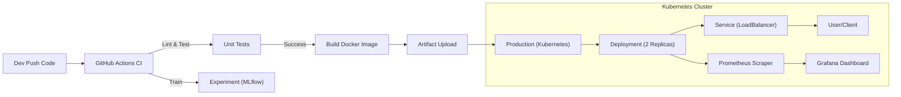
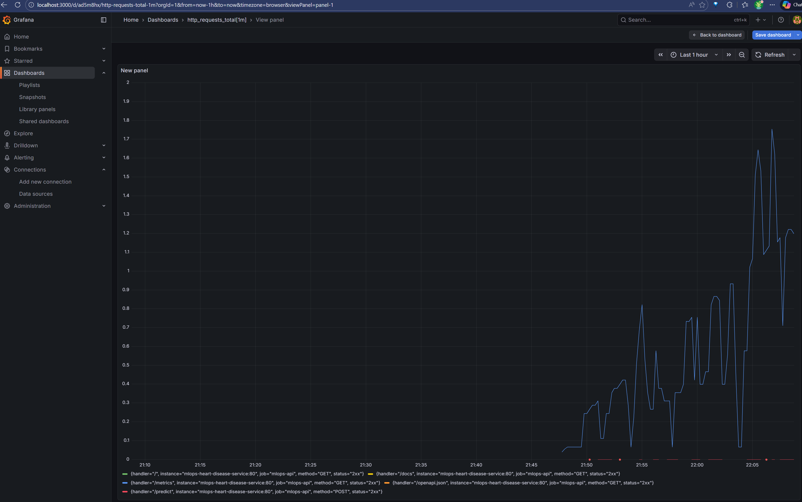

# MLOps Project Report - Heart Disease Prediction

**Repository**: [GitHub Repository](https://github.com/yashvr96/mlops.git)

## 1. Introduction
This project implements an end-to-end MLOps pipeline for predicting heart disease risk. It covers data acquisition, model training, experiment tracking, containerization, and deployment on Kubernetes with automated CI/CD and monitoring.

---

## 2. Setup & Installation Instructions

### Prerequisites
*   Docker Desktop (with Kubernetes enabled)
*   Python 3.9+
*   Git

### Steps to Run Locally
1.  **Clone the Repository**:
    ```bash
    git clone https://github.com/yashvr96/mlops.git
    cd mlops
    ```
2.  **Environment Setup**:
    ```bash
    python -m venv .venv
    .\.venv\Scripts\Activate.ps1
    pip install -r requirements.txt
    ```
3.  **Run Training**:
    ```bash
    python src/data_loader.py
    python src/train.py --model_type logistic_regression
    python src/train.py --model_type random_forest
    ```
4.  **Run Locally**:
    ```bash
    uvicorn src.app:app --reload
    ```

---

## 3. EDA and Modeling Choices

### Data Processing
*   **Dataset**: UCI Heart Disease Data (fetched via `ucimlrepo`).
*   **Cleaning**: 
    *   Missing values were imputed using the **median** for numerical features and **mode** for categorical features.
    *   Duplicates were removed.
*   **Preprocessing**:
    *   Target `num` converted to binary (0 = Low Risk, 1 = High Risk).
    *   Features scaled using `StandardScaler` to ensure convergence for linear models and correct distance calculations.

### Model Selection & Tuning
We experimented with two models to balance interpretability and performance:

1.  **Logistic Regression**:
    *   *Why*: Simple, interpretable, and establishes a strong baseline.
    *   *Tuning*: We tuned the inverse regularization strength `C`.
    *   *Result*: Achieved **~88% Accuracy** and **0.92 ROC-AUC**.

2.  **Random Forest**:
    *   *Why*: Captures non-linear relationships and interactions between features.
    *   *Tuning*: We tuned `n_estimators` (number of trees) and `max_depth` (to control overfitting).
    
**Conclusion**: Logistic Regression performed surprisingly well and is highly efficient for inference, making it our primary candidate for deployment.

---

## 4. Experiment Tracking Summary
We used **MLflow** to track all experiments.
*   **Parameters Logged**: `model_type`, `C`, `n_estimators`, `max_depth`.
*   **Metrics**: Accuracy, Precision, Recall, ROC-AUC.
*   **Artifacts**: Confusion Matrix, ROC Curve, `model.pkl`, `scaler.joblib`.

*(Insert screenshot of MLflow UI here)*

---

## 5. System Architecture
The following diagram illustrates the MLOps pipeline flow from code commit to production monitoring.



---

## 6. CI/CD & Deployment

### CI/CD Pipeline (GitHub Actions)
Our `.github/workflows/ci_cd.yml` automates:
1.  **Linting**: Ensures code quality with `flake8`.
2.  **Testing**: Verifies logic with `pytest`.
3.  **Training Verification**: Runs training scripts to ensure no runtime errors.
4.  **Artifacts**: Uploads trained models for review.
5.  **Build**: Packages the application into a Docker container.

### Deployment (Kubernetes)
The application is deployed using declarative manifests:
*   **Deployment**: Runs 2 replicas of the API for high availability.
*   **Service**: Exposes the API on Port 80 via `LoadBalancer`.
*   **Monitoring**: A sidecar stack of Prometheus and Grafana tracks API health (`/metrics`).

---

## 7. Monitoring
We integrated **Prometheus** instrumentation into the FastAPI app.
*   **Metrics Endpoint**: `/metrics`
*   **Dashboard**: Grafana verifies `http_requests_total` and latency to ensure the API is responsive.



---

## 8. Cleanup
To stop all running services and clean up your environment:

1.  **Stop Kubernetes Deployment**:
    ```powershell
    kubectl delete -f k8s/monitoring.yaml
    kubectl delete -f k8s/service.yaml
    kubectl delete -f k8s/deployment.yaml
    ```

2.  **Stop MLflow**:
    *   Press `CTRL+C` in the terminal where `mlflow ui` is running.

3.  **Stop Local API (if running)**:
    *   Press `CTRL+C` in the terminal where `uvicorn` is running.

4.  **Remove Docker Image (Optional)**:
    ```powershell
    docker rmi mlops-heart-disease:latest
    ```
